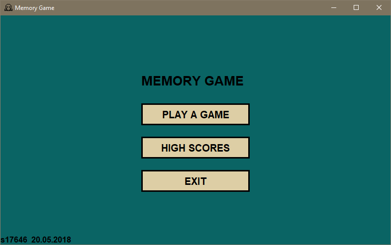
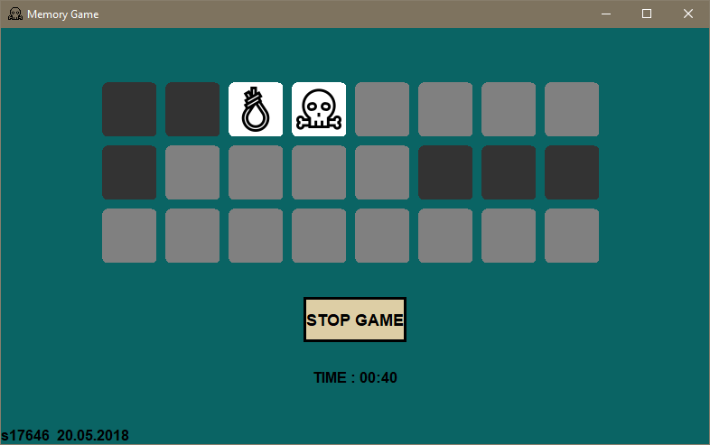

# MemoryGameGUI

Basic Memory Game made with Swing components. Created for GUI classes at Polish-Japanese Academy of Information Technology.

## General info

Goal of the memory game is to match every pair of the same cards, while there can be only 2 cards uncovered at the same time.

Application provides:
game with any even number of cards in the range of 2-100, 
timer,
table of high scores, 
customized components.

## Illustrations

## Technologies

Java 1.8

## Credits

Icons' source:
https://www.flaticon.com/packs/pirates-20
